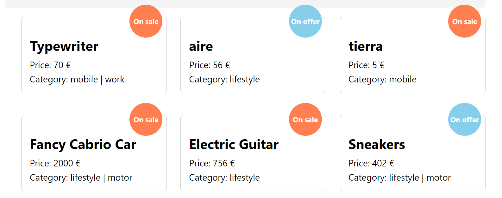

# Second hand store using React

This is a SPA project for the "React basics" module, as part of the bootcamp "Web Development XVI Edition", by KeepCoding.

The task consists in building an application to display ads for items on sale/search.

## Backend: Nodepop API

Our React store uses [Nodepop API](https://github.com/davidjj76/nodepop-api) as a backend. Please, find instructions on how to put it live [here](https://github.com/davidjj76/nodepop-api).

IMPORTANT: set a .env with this variable:

```js
REACT_APP_API_BASE_URL = http://localhost:3001/
```

## Create React App

The app is built using Create React App. To run it, please use:

Run it in the developement mode:

```sh
npm start
```

Run it in the production mode:

```sh
npm build
```

## Routes

### Public routes

#### /Login

Served by the component LoginPage, it is the unique public route in the project. No authorization is needed to navigate to this URL. It renders the login form.

#### Authorization token

If you wan't to storage your authentication token, click the checkbox in the login form:


### Protected routes

You need to login in order to see these routes.

#### /adverts



Served by the component AdvertsPage. If any, it shows a list of the adverts available at that time. In this screen, the adverts show:

- Name
- Type of offer: on sale / on search
- Price in €
- Category (tags)

If there is no advert to show, user will get a call to action with a button to create an advert.

##### Filters zone

There is a place reserved for filters in this screen:


- By name: filters by the name of the ad.
- By category: filters by the tags of the ad. To get a match, the advert needs to have the same tags marked in the select input.
- By price range: use the slider to set a minimum and maximum range of prices to retrieve the adverts you want.

Use "reset filters" button to delete the filters when you don't need them anymore.

By clicking in one of the adverts you will navigate to the advert's detail screen.

#### /adverts/:id

Here you can see the detail of the advert you want. It is managed by the component AdvertPage.


The advert detail shows:

- Name
- Price in €
- Category (tags)
- Type of offer: on sale / on search
- Photo: 300px x 300px

If the advert doesn't have any photo, it will show a default backup image:


##### Delete advert

The detail of the advcert includes a setup to delete the advert. A confirmation flow is shown before deleting the ad.


Confirmation:


Deletion;


#### /adverts/new

This one is served by the component NewAdvertPage. It is a form to submit new adverts.


All inputs are required except "photo". The sbmit button will stay disabled until the form is fulfilled.

## Secondary components

The components detailed above are using smaller components to manage their functionalities.

### NewAdvertForm

It is one of the biggest component in the setup and the core of NewAdvertPage.

### Advert

It is the core component for AdvertPage.

### AdvertPage

It is the core component for AdvertsPage.

## Basic components

These are smaller components shared by the biggest ones:

- Button
- CheckBox
- FileInput
- FilterCase
- FormField
- Photo
- SelectMenu
- SliderRange

## Communication flow

Error / success is represented by:

- Disabling /enabling buttons
- Error messages in red
- Success messages in green
